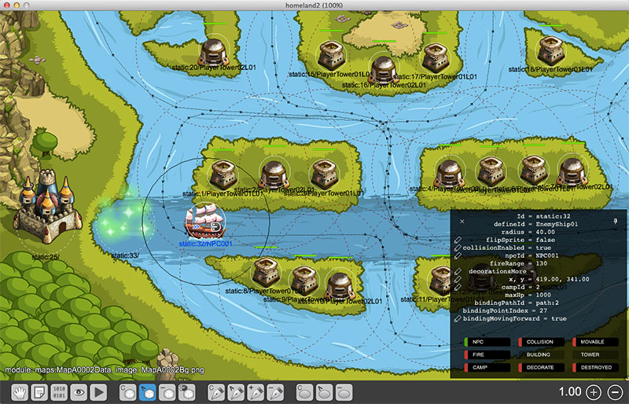

Homeland2_Map_Editor
====================

这是一个开源的塔防游戏编辑器。

-   基于 [quick-cocos2d-x](https://github.com/chukong/quick-cocos2d-x) 开发，并保持升级
-   纯 Lua 实现
-   Entity-Component 架构
-   暂时只是一个测试分支（往后的方向会比quick有方向，因为quick想在已经毫无方向，主要也只能维护plugin-in模块）
-   原项目以及quick项目在2016几乎是没有更新，也是悲哀，所以把自己的分支迁移到这里

运行截图：

